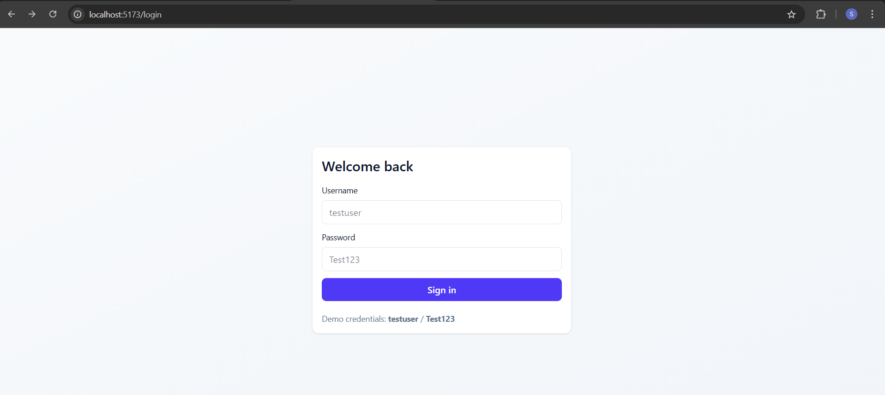
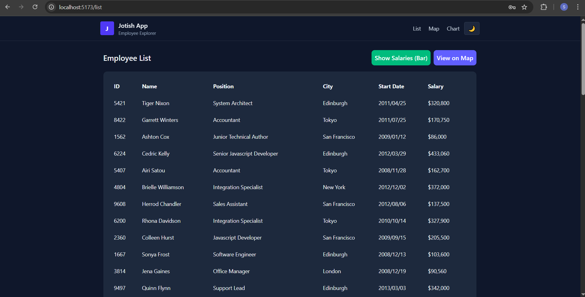
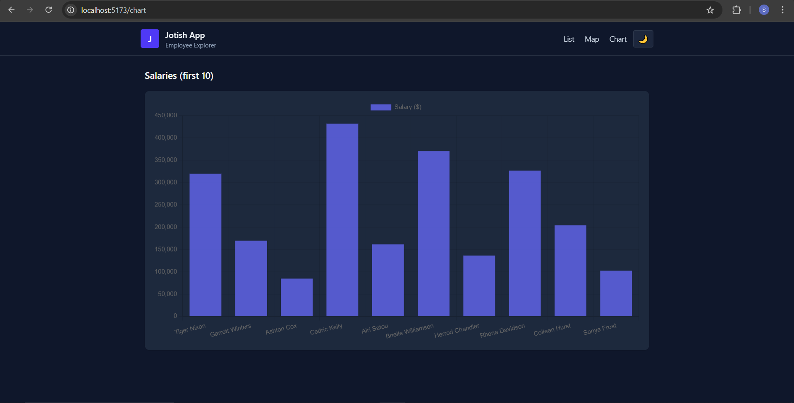
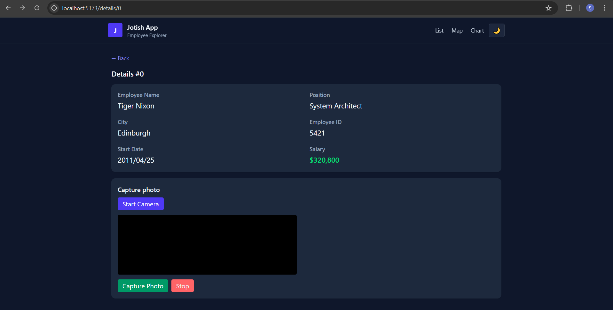

Project for the Jotish React assignment.

Notes:
- The UI uses Tailwind CSS and a shadcn-inspired style (light, modern).
- Login uses credentials: testuser / Test123
- List page fetches data from the provided API with the required POST payload.
- Details page lets you capture a photo from the camera; result shown on Photo Result page.
- Bar chart page plots salaries for the first 10 rows.

Following are the Screenshots of the protect:
1. Login Page

2. Home Page

3. Bar Graph Page

4. World Map Page

5. Live Camera Capture Page

Following is the complete Video tutorial of workflow of Application:
